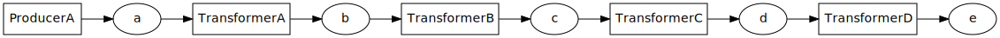
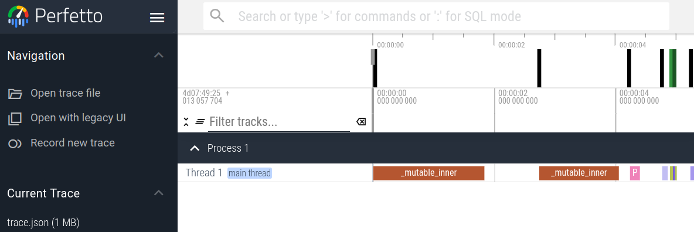
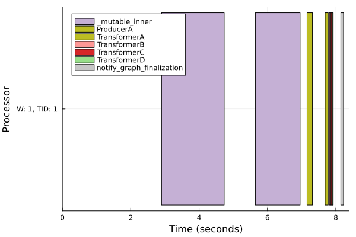
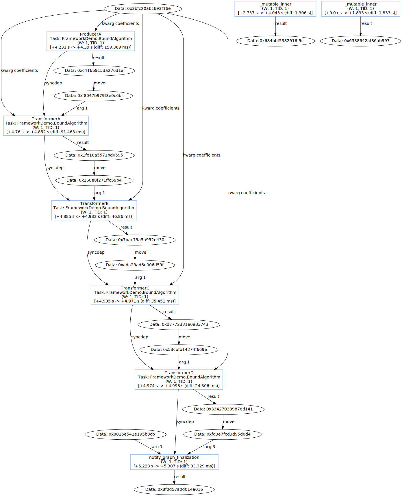
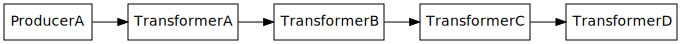

# Logs visualization

FrameworkDemo derives its logging and visualization capabilities from [Dagger](https://github.com/JuliaParallel/Dagger.jl).

The examples shown in this section where obtained for the following artificial workflow:

## Showcase

The logs can be visualized with the following modes:

- raw - textual representation possibly in json format
- chrome-trace - task execution timeline in chrome-trace format. Can be displayed with web applications such as [perfetto](https://ui.perfetto.dev) or [firefox profiler](https://profiler.firefox.com/)
  
- Gantt chart - a figure showing task execution timeline
  
- graph - a graphviz graph of executed tasks
  

## Execution plan

Beside post-execution logs its also possible to obtain a pre-execution plan for a given workflow.

